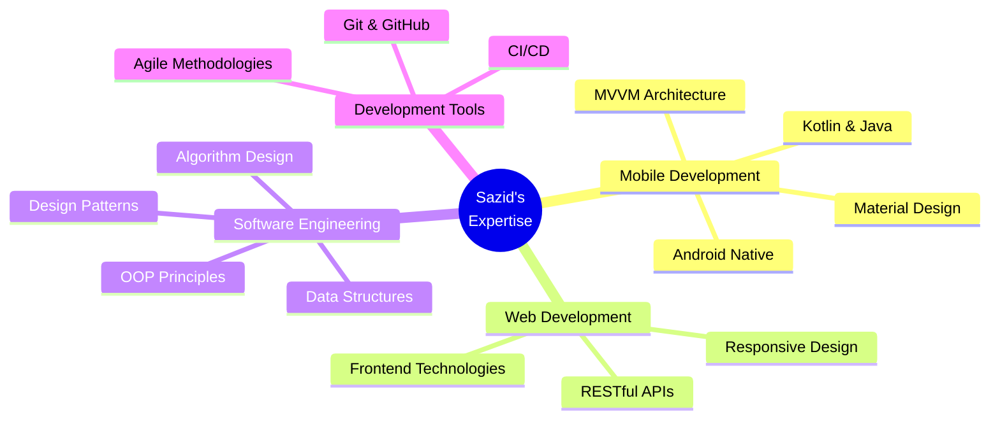
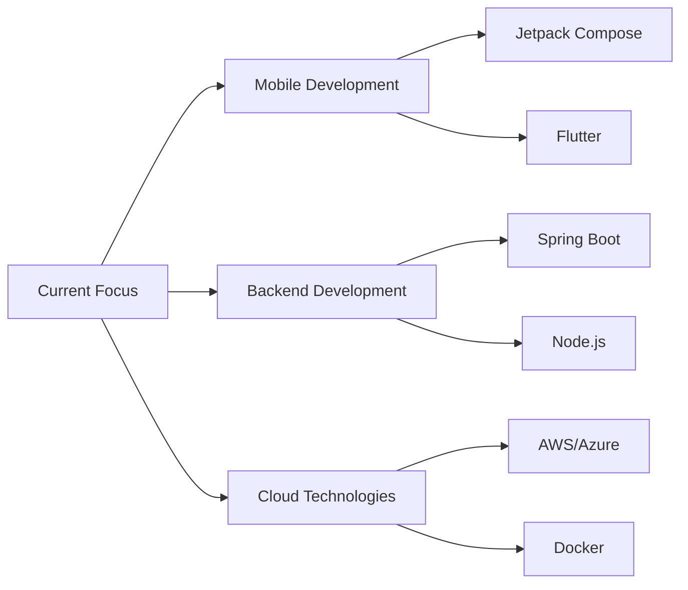

<div align="center">

# 👨‍💻 Md. AHASANUL HAQUE SAZID


[](https://linkedin.com/in/sksazid01)
[](https://github.com/sksazid01)
[](mailto:ahasanulhaque20@gmail.com)
[](https://github.com/sksazid01)


</div>

---

## 👤 About Me

```typescript
const sazid = {
    location: "Sylhet, Bangladesh 🇧🇩",
    education: "B.Sc. in Computer Science & Engineering",
    university: "Shahjalal University of Science and Technology (SUST)",
    roles: ["Mobile App Developer", "Full-Stack Developer", "Problem Solver"],
    languages: ["Bengali", "English"],
    currentFocus: ["Android Development", "Cross-Platform Solutions", "Cloud Technologies"],
    communities: ["Open Source", "Tech Conferences", "Developer Meetups"],
    lifePhilosophy: "Code with purpose, learn continuously, and share knowledge"
};
```

<details>
<summary><b>🎯 Professional Summary</b></summary>

<br>

I am a passionate **Computer Science Engineering student** at **Shahjalal University of Science and Technology (SUST)**, with hands-on experience in developing scalable mobile and web applications. My journey in software development is driven by a commitment to clean code, innovative solutions, and continuous learning.

### 🌟 Core Competencies



</details>

---

## �️ Technology Stack

<div align="center">

### 💻 Programming Languages

<table>
<tr>
<td align="center" width="96">

<br>Java
</td>
<td align="center" width="96">

<br>Kotlin
</td>
<td align="center" width="96">

<br>Python
</td>
<td align="center" width="96">

<br>JavaScript
</td>
<td align="center" width="96">

<br>C
</td>
<td align="center" width="96">

<br>C++
</td>
</tr>
</table>

### 📱 Mobile & Web Development

<table>
<tr>
<td align="center" width="96">

<br>Android Studio
</td>
<td align="center" width="96">

<br>Firebase
</td>
<td align="center" width="96">

<br>HTML5
</td>
<td align="center" width="96">

<br>CSS3
</td>
<td align="center" width="96">

<br>React
</td>
<td align="center" width="96">

<br>Node.js
</td>
</tr>
</table>

### 🗄️ Databases & Cloud

<table>
<tr>
<td align="center" width="96">

<br>MySQL
</td>
<td align="center" width="96">

<br>MongoDB
</td>
<td align="center" width="96">

<br>SQLite
</td>
<td align="center" width="96">

<br>PostgreSQL
</td>
</tr>
</table>

### 🔧 Tools & Platforms

<table>
<tr>
<td align="center" width="96">

<br>Git
</td>
<td align="center" width="96">

<br>GitHub
</td>
<td align="center" width="96">

<br>VS Code
</td>
<td align="center" width="96">

<br>Linux
</td>
<td align="center" width="96">

<br>Figma
</td>
<td align="center" width="96">

<br>Postman
</td>
</tr>
</table>

</div>

---

## 🚀 Featured Projects

<div align="center">

### 🍔 Eatery - Food Ordering Application
[](https://github.com/sksazid01/Eatery-Android-App)

A comprehensive Android food ordering application featuring modern UI/UX design and robust backend integration.

**Key Features:**
- 🔐 Secure user authentication & authorization
- 📱 Real-time menu browsing with search functionality
- 🛒 Shopping cart with dynamic price calculation
- 📦 Order tracking and history management
- 💳 Multiple payment gateway integration

**Tech Stack:** `Kotlin` `Android SDK` `Firebase` `MVVM` `Material Design` `Retrofit`

---

### 🎮 Interactive Word Game
[](https://github.com/sksazid01/Word-Game-JavaFX)

Desktop word puzzle game with elegant JavaFX GUI, implementing advanced game logic and user interaction.

**Key Features:**
- 🎯 Dynamic word generation algorithm
- 🏆 Scoring system with difficulty levels
- 💾 Save/Load game functionality
- 🎨 Responsive and intuitive UI

**Tech Stack:** `Java` `JavaFX` `Scene Builder` `MVC Pattern`

---

### 🌍 Flag Quiz - Geography Learning App
[](https://github.com/sksazid01/Flag-Quiz)

Educational quiz application to enhance geographical knowledge through interactive flag identification.

**Key Features:**
- 🗺️ Database of 190+ countries and flags
- ⏱️ Timed quiz modes with leaderboards
- 📊 Progress tracking and statistics
- 🎓 Learning mode with detailed information

**Tech Stack:** `Java` `Android` `SQLite` `Custom Views`

---

### 🏫 College Community Platform
[](https://github.com/sksazid01/COLLEGESAMAJ)

Web platform designed for college community engagement, developed during professional internship.

**Key Features:**
- 👥 User profiles and social networking
- 📢 Announcement and event management
- 💬 Real-time messaging system
- 📱 Fully responsive design

**Tech Stack:** `HTML5` `CSS3` `JavaScript` `Bootstrap` `PHP`

---

### 🤖 Social Media Automation Tool
[](https://github.com/sksazid01/Facebook_Auto_Poke_Back)

Python automation script demonstrating API integration and automated social media interactions.

**Key Features:**
- 🔄 Automated response system
- 📊 Activity analytics dashboard
- ⚙️ Configurable automation rules
- 🔐 Secure authentication handling

**Tech Stack:** `Python` `Selenium` `REST APIs` `BeautifulSoup`

</div>

<div align="center">

### 📂 [View All Projects →](https://github.com/sksazid01?tab=repositories)

</div>

---

## 📊 GitHub Analytics & Insights

<div align="center">


</div>

<div align="center">
  
  
</div>

<div align="center">
  
</div>

<div align="center">
  
</div>

### 📈 Contribution Statistics

<div align="center">

```text
Total Contributions:  500+          Total Repositories:  25+
Stars Earned:         50+           Forks:              15+
Active Projects:      10+           Pull Requests:       20+
```

</div>

---

## 🎯 Current Focus & Learning Journey

<div align="center">



</div>

### 📚 Learning Path 2025

<table>
<tr>
<td width="50%">

#### 🎨 Frontend Development
- [ ] Advanced React.js & Next.js
- [ ] TypeScript Mastery
- [ ] Progressive Web Apps (PWA)
- [x] Responsive Design Principles
- [x] Material Design Guidelines

</td>
<td width="50%">

#### ⚙️ Backend Development
- [ ] Microservices Architecture
- [ ] GraphQL APIs
- [ ] Spring Boot Framework
- [x] RESTful API Design
- [x] Database Management

</td>
</tr>
<tr>
<td width="50%">

#### 📱 Mobile Development
- [x] Native Android Development
- [ ] Jetpack Compose
- [ ] Flutter Cross-Platform
- [ ] React Native
- [x] MVVM Architecture

</td>
<td width="50%">

#### ☁️ DevOps & Cloud
- [ ] Docker & Kubernetes
- [ ] CI/CD Pipelines
- [ ] AWS/Azure Services
- [ ] Terraform
- [x] Git Version Control

</td>
</tr>
</table>

### 🤝 Open for Collaboration

<div align="center">

```diff
+ 🚀 Open Source Projects
+ 💼 Freelance Opportunities
+ 🎓 Academic Research
+ 📱 Mobile App Development
+ 🌐 Web Development Projects
+ 🤖 Automation & Scripting
```

</div>

### 💡 What I Can Help With

<details>
<summary><b>Click to expand my areas of expertise</b></summary>

<br>

- **🏗️ Software Architecture**
  - Clean Architecture principles
  - MVVM, MVP, MVI patterns
  - Modular app development
  - Scalable system design

- **📱 Android Development**
  - Custom UI components
  - Performance optimization
  - Offline-first architecture
  - Material Design implementation

- **💻 Full-Stack Development**
  - RESTful API development
  - Database design & optimization
  - Authentication & authorization
  - Real-time features

- **🎓 Mentorship**
  - Code reviews & best practices
  - Career guidance for students
  - Project consultation
  - Technical interview preparation

</details>

---

## 🏆 Achievements & Certifications

<div align="center">

<table>
<tr>
<td align="center" width="33%">

<br><sub>Consistent High Performance</sub>
</td>
<td align="center" width="33%">

<br><sub>Completed Projects</sub>
</td>
<td align="center" width="33%">

<br><sub>GitHub Recognition</sub>
</td>
</tr>
</table>

</div>

---

## 💬 Let's Connect & Collaborate

<div align="center">

### 📫 Get in Touch

I'm always open to discussing new projects, creative ideas, or opportunities to be part of your vision. Feel free to reach out!

<table>
<tr>
<td align="center" width="25%">
<a href="https://linkedin.com/in/sksazid01">

</a>
<br><sub>Professional Network</sub>
</td>
<td align="center" width="25%">
<a href="mailto:sksazid01@gmail.com">

</a>
<br><sub>Direct Message</sub>
</td>
<td align="center" width="25%">
<a href="https://github.com/sksazid01">

</a>
<br><sub>Code Portfolio</sub>
</td>
<td align="center" width="25%">
<a href="https://github.com/sksazid01">

</a>
<br><sub>Personal Website</sub>
</td>
</tr>
</table>

### 📍 Location & Availability

```geojson
{
  "type": "FeatureCollection",
  "features": [
    {
      "type": "Feature",
      "properties": {
        "name": "Sylhet, Bangladesh",
        "status": "Available for opportunities",
        "timezone": "GMT+6"
      },
      "geometry": {
        "type": "Point",
        "coordinates": [91.8833, 24.9000]
      }
    }
  ]
}
```

### 🌐 Social Media Presence

[](https://facebook.com/sksazid01)
[](https://twitter.com/sksazid01)
[](https://instagram.com/sksazid01)
[](https://stackoverflow.com/users/sksazid01)

</div>

---

## 📝 Latest Blog Posts

<!-- BLOG-POST-LIST:START -->
- 🚀 Building Scalable Android Apps with MVVM Architecture
- 💡 10 Best Practices for Clean Code in Kotlin
- 🎨 Mastering Material Design 3 in Android
- 🔧 Optimizing App Performance: A Comprehensive Guide
- 🌐 Integrating REST APIs in Android Applications
<!-- BLOG-POST-LIST:END -->

➡️ [Read more blog posts...](https://github.com/sksazid01)

---

<div align="center">

### 💭 Random Dev Quote


### 😄 Developer Humor


---

### 📊 Weekly Development Breakdown

<!--START_SECTION:waka-->
```text
Kotlin       8 hrs 45 mins   ███████████░░░░░░   45.2%
Java         5 hrs 12 mins   ██████░░░░░░░░░░░   26.8%
Python       2 hrs 30 mins   ███░░░░░░░░░░░░░░   12.9%
JavaScript   1 hr 45 mins    ██░░░░░░░░░░░░░░░    9.1%
XML          1 hr 10 mins    █░░░░░░░░░░░░░░░░    6.0%
```
<!--END_SECTION:waka-->

---


<sub>⭐️ From [sksazid01](https://github.com/sksazid01) with ❤️ | Last updated: November 2025</sub>

</div>
