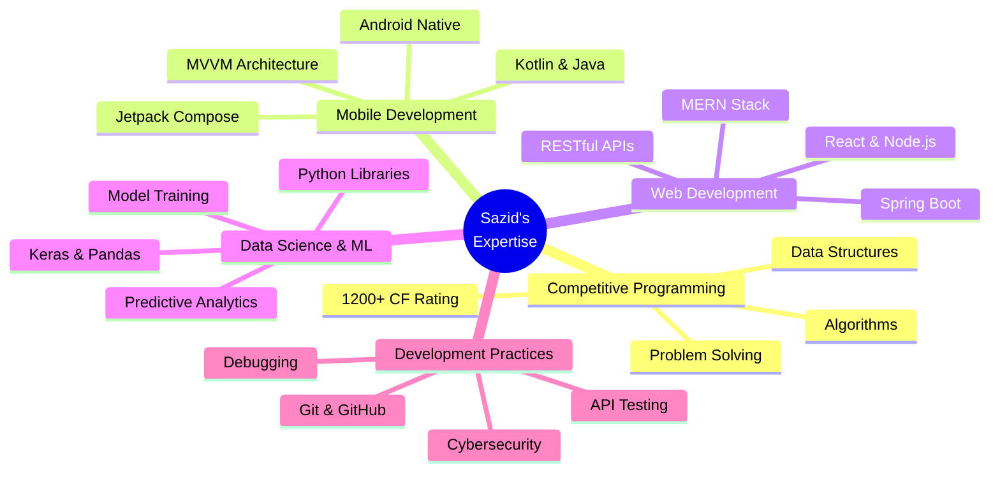

<div align="center">

# 👨‍💻 Md. AHASANUL HAQUE SAZID


[](https://linkedin.com/in/sksazid01)
[](https://github.com/sksazid01)
[](mailto:ahasanulhaque20@gmail.com)
[](sksazid.me)


</div>

---

## 👤 About Me

```typescript
const sazid = {
    name: "Md. Ahasanul Haque Sazid",
    location: "Bogura → Sylhet, Bangladesh 🇧🇩",
    email: "ahasanulhaque20@gmail.com",
    website: "sksazid.me",
    education: "B.Sc. in Computer Science & Engineering",
    university: "Shahjalal University of Science and Technology (SUST)",
    expectedGraduation: "2026",
    currentYear: "Final Year Student",
    roles: [
        "Competitive Programmer", 
        "Mobile App Developer", 
        "Full-Stack Developer",
        "AI/ML Enthusiast"
    ],
    achievements: {
        codeforces: "1200+ Rating (Pupil)",
        codechef: "1437 Rating (2★)",
        hackathons: ["HackTheAI Grand Final - 4th Place", "HackTheAI Preliminary - 6th Place"],
        competitions: "SUST IUPC 2023 Participant"
    },
    languages: ["Bengali (Native)", "English (Professional)"],
    currentFocus: [
        "Android Development with Jetpack Compose",
        "Machine Learning & AI Agents", 
        "Data Structures & Algorithms",
        "Competitive Programming"
    ],
    interests: ["Machine Learning", "AI Agents", "Robotics", "Cybersecurity", "Blockchain"],
    lifePhilosophy: "A dedicated Problem Solver and Quick Learner 🚀"
};
```

<details>
<summary><b>🎯 Professional Summary</b></summary>

<br>

> *"A dedicated Problem Solver and Quick Learner"*

I am a **Final Semester Computer Science Engineering student** at **Shahjalal University of Science and Technology (SUST)**, passionate about building impactful technology. With hands-on experience in development, machine learning, and API testing, I've achieved notable rankings in competitive programming platforms and hackathons.

### 🌟 Core Competencies



### 💼 Professional Experience Highlights

- 🏆 **Competitive Programmer** | 1200+ Codeforces Rating (Pupil) | 1437 CodeChef Rating (2★)
- 🤖 **AI Trainer & Tester** | Trained chatbots for Bangla language and coding tasks
- 📊 **Data Science Specialist** | Worked with Keras, NumPy, Matplotlib, Pandas for ML projects
- 💻 **Full-Stack Developer** | Built MERN stack applications and Spring Boot APIs
- 🥇 **Hackathon Finalist** | 4th Place in HackTheAI Grand Final (Smart-IELTS platform)

</details>

---

## �️ Technology Stack

<div align="center">

### 💻 Programming Languages

<table>
<tr>
<td align="center" width="96">

<br>Java
</td>
<td align="center" width="96">

<br>Kotlin
</td>
<td align="center" width="96">

<br>Python
</td>
<td align="center" width="96">

<br>JavaScript
</td>
<td align="center" width="96">

<br>C
</td>
<td align="center" width="96">

<br>C++
</td>
</tr>
</table>

### 📱 Mobile & Web Development

<table>
<tr>
<td align="center" width="96">

<br>Android Studio
</td>
<td align="center" width="96">

<br>Firebase
</td>
<td align="center" width="96">

<br>Spring Boot
</td>
<td align="center" width="96">

<br>HTML5
</td>
<td align="center" width="96">

<br>CSS3
</td>
<td align="center" width="96">

<br>React
</td>
<td align="center" width="96">

<br>Node.js
</td>
<td align="center" width="96">

<br>Express.js
</td>
</tr>
</table>

### 🗄️ Databases & Cloud

<table>
<tr>
<td align="center" width="96">

<br>MySQL
</td>
<td align="center" width="96">

<br>MongoDB
</td>
<td align="center" width="96">

<br>SQLite
</td>
<td align="center" width="96">

<br>PostgreSQL
</td>
</tr>
</table>

### 🔧 Tools & Platforms

<table>
<tr>
<td align="center" width="96">

<br>Git
</td>
<td align="center" width="96">

<br>GitHub
</td>
<td align="center" width="96">

<br>VS Code
</td>
<td align="center" width="96">

<br>Linux
</td>
<td align="center" width="96">

<br>Figma
</td>
<td align="center" width="96">

<br>Postman
</td>
</tr>
</table>

</div>

---

## 🚀 Featured Projects

<div align="center">

### � Smart-IELTS Platform (HackTheAI - Grand Final 4th Place)
[](https://hacktheai.com)

AI-powered IELTS preparation platform using SmythOS agents. Secured **4th position among 50 finalist teams** from universities across Bangladesh.

**Key Features:**
- 🤖 AI-powered learning agents for personalized IELTS training
- 📊 Machine Learning models for performance prediction
- 🎯 Adaptive practice modules
- 📈 Real-time progress tracking and analytics

**Tech Stack:** `SmythOS` `AI Agents` `React` `Node.js` `Machine Learning` `Python`

**Achievement:** 🥇 **Grand Final - 4th Place** | September 2025

---

### 🛒 E-commerce Marketplace
[](https://github.com/sksazid01)

Full-featured e-commerce platform with comprehensive seller and buyer management system.

**Key Features:**
- 🏪 Multi-vendor marketplace architecture
- 🛍️ Product catalog with advanced search & filters
- 💳 Secure payment processing
- 📦 Order tracking and inventory management
- ⭐ Review and rating system

**Tech Stack:** `Java` `Servlet` `JPA` `MySQL` `Bootstrap`  
**Timeline:** February 2023 - July 2023

---

### 🏢 Club Management System
[](https://github.com/sksazid01)

Modern club management solution built with MERN stack for efficient event and member management.

**Key Features:**
- � Member registration and profile management
- 📅 Event scheduling and RSVP system
- 💰 Payment tracking and financial reports
- 📧 Automated email notifications
- 📊 Analytics dashboard for club activities

**Tech Stack:** `MongoDB` `Express.js` `React` `Node.js`  
**Timeline:** January 2025 - July 2025

---

### 🍽️ Restaurant Management System
[](https://github.com/sksazid01)

Comprehensive restaurant management system with modern UI using Jetpack Compose.

**Key Features:**
- � Table booking and reservation system
- 🍔 Digital menu with real-time updates
- 🧾 Order management and billing
- �‍🍳 Kitchen display system (KDS)
- 📈 Sales analytics and reports

**Tech Stack:** `Kotlin` `Jetpack Compose` `Room Database` `MVVM`  
**Timeline:** October 2023 - March 2025

---

### 🎮 Word Matching Game
[](https://github.com/sksazid01/Word-Game-JavaFX)

Interactive word puzzle game with elegant JavaFX UI design.

**Key Features:**
- 🎯 Dynamic word generation algorithm
- 🏆 Scoring system with difficulty levels
- 💾 Save/Load game functionality
- 🎨 Intuitive and responsive UI

**Tech Stack:** `Java` `JavaFX` `UI Design`  
**Timeline:** April 2023 - June 2023

---

### 🌍 Flag Quiz - Geography Learning App
[](https://github.com/sksazid01/Flag-Quiz)

Educational quiz application to enhance geographical knowledge through interactive flag identification.

**Key Features:**
- 🗺️ Database of 190+ countries and flags
- ⏱️ Timed quiz modes with leaderboards
- 📊 Progress tracking and statistics
- 🎓 Learning mode with detailed information

**Tech Stack:** `Java` `Android` `SQLite` `Custom Views`

---

### 🏫 College Samaj - Community Platform
[](https://github.com/sksazid01/COLLEGESAMAJ)

Web platform for college community engagement developed during internship at College Samaj.

**Key Features:**
- 👥 User profiles and social networking
- 📢 Announcement and event management
- 💬 Community discussion forums
- 📱 Fully responsive design

**Tech Stack:** `HTML5` `CSS3` `JavaScript` `Bootstrap`  
**Timeline:** January 2024 - February 2024 (Internship)

</div>

<div align="center">

### 📂 [View All Projects →](https://github.com/sksazid01?tab=repositories)

</div>

---

## 📊 GitHub Analytics & Insights

<div align="center">


</div>

<div align="center">
  
  
</div>

<div align="center">
  
</div>

<div align="center">
  
</div>

### 📈 Contribution Statistics

<div align="center">

```text
Total Contributions:  500+          Total Repositories:  25+
Stars Earned:         50+           Forks:              15+
Active Projects:      10+           Pull Requests:       20+
```

</div>

---

## 🎯 Current Focus & Learning Journey

<div align="center">


</div>

### 📚 Learning Path 2025

<table>
<tr>
<td width="50%">

#### 🎨 Frontend Development
- [ ] Advanced React.js & Next.js
- [ ] TypeScript Mastery
- [ ] Progressive Web Apps (PWA)
- [x] Responsive Design Principles
- [x] Material Design Guidelines

</td>
<td width="50%">

#### ⚙️ Backend Development
- [ ] Microservices Architecture
- [ ] GraphQL APIs
- [ ] Spring Boot Framework
- [x] RESTful API Design
- [x] Database Management

</td>
</tr>
<tr>
<td width="50%">

#### 📱 Mobile Development
- [x] Native Android Development
- [ ] Jetpack Compose
- [ ] Flutter Cross-Platform
- [ ] React Native
- [x] MVVM Architecture

</td>
<td width="50%">

#### ☁️ DevOps & Cloud
- [ ] Docker & Kubernetes
- [ ] CI/CD Pipelines
- [ ] AWS/Azure Services
- [ ] Terraform
- [x] Git Version Control

</td>
</tr>
</table>

### 🤝 Open for Collaboration

<div align="center">

```diff
+ 🚀 Open Source Projects
+ 💼 Freelance Opportunities
+ 🎓 Academic Research
+ 📱 Mobile App Development
+ 🌐 Web Development Projects
+ 🤖 Automation & Scripting
```

</div>

### 💡 What I Can Help With

<details>
<summary><b>Click to expand my areas of expertise</b></summary>

<br>

- **🏗️ Software Architecture**
  - Clean Architecture principles
  - MVVM, MVP, MVI patterns
  - Modular app development
  - Scalable system design

- **📱 Android Development**
  - Custom UI components
  - Performance optimization
  - Offline-first architecture
  - Material Design implementation

- **💻 Full-Stack Development**
  - RESTful API development
  - Database design & optimization
  - Authentication & authorization
  - Real-time features

- **🎓 Mentorship**
  - Code reviews & best practices
  - Career guidance for students
  - Project consultation
  - Technical interview preparation

</details>

---

## 🏆 Achievements & Certifications

<div align="center">

<table>
<tr>
<td align="center" width="33%">

<br><sub>Consistent High Performance</sub>
</td>
<td align="center" width="33%">

<br><sub>Completed Projects</sub>
</td>
<td align="center" width="33%">

<br><sub>GitHub Recognition</sub>
</td>
</tr>
</table>

</div>

---

## 💬 Let's Connect & Collaborate

<div align="center">

### 📫 Get in Touch

I'm always open to discussing new projects, creative ideas, or opportunities to be part of your vision. Feel free to reach out!

<table>
<tr>
<td align="center" width="25%">
<a href="https://linkedin.com/in/sksazid01">

</a>
<br><sub>Professional Network</sub>
</td>
<td align="center" width="25%">
<a href="mailto:sksazid01@gmail.com">

</a>
<br><sub>Direct Message</sub>
</td>
<td align="center" width="25%">
<a href="https://github.com/sksazid01">

</a>
<br><sub>Code Portfolio</sub>
</td>
<td align="center" width="25%">
<a href="https://github.com/sksazid01">

</a>
<br><sub>Personal Website</sub>
</td>
</tr>
</table>

### 📍 Location & Availability

```geojson
{
  "type": "FeatureCollection",
  "features": [
    {
      "type": "Feature",
      "properties": {
        "name": "Sylhet, Bangladesh",
        "status": "Available for opportunities",
        "timezone": "GMT+6"
      },
      "geometry": {
        "type": "Point",
        "coordinates": [91.8833, 24.9000]
      }
    }
  ]
}
```

### 🌐 Social Media Presence

[](https://facebook.com/sksazid01)
[](https://twitter.com/sksazid01)
[](https://instagram.com/sksazid01)
[](https://stackoverflow.com/users/sksazid01)

</div>

---

## 📝 Latest Blog Posts

<!-- BLOG-POST-LIST:START -->
- 🚀 Building Scalable Android Apps with MVVM Architecture
- 💡 10 Best Practices for Clean Code in Kotlin
- 🎨 Mastering Material Design 3 in Android
- 🔧 Optimizing App Performance: A Comprehensive Guide
- 🌐 Integrating REST APIs in Android Applications
<!-- BLOG-POST-LIST:END -->

➡️ [Read more blog posts...](https://github.com/sksazid01)

---

<div align="center">

### 💭 Random Dev Quote


### 😄 Developer Humor


---

### 📊 Weekly Development Breakdown

<!--START_SECTION:waka-->
```text
Kotlin       8 hrs 45 mins   ███████████░░░░░░   45.2%
Java         5 hrs 12 mins   ██████░░░░░░░░░░░   26.8%
Python       2 hrs 30 mins   ███░░░░░░░░░░░░░░   12.9%
JavaScript   1 hr 45 mins    ██░░░░░░░░░░░░░░░    9.1%
XML          1 hr 10 mins    █░░░░░░░░░░░░░░░░    6.0%
```
<!--END_SECTION:waka-->

---


<sub>⭐️ From [sksazid01](https://github.com/sksazid01) with ❤️ | Last updated: November 2025</sub>

</div>
